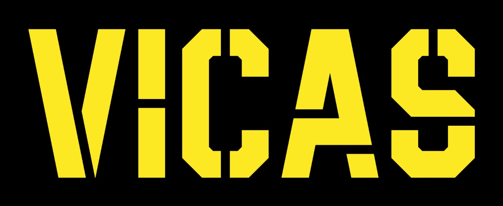

# VICAS: Voice Inspection and CAT Audit System
Submission to Caterpillar Inc. Code-a-thon. 

<div align="center">

</div>

VICAS is an AI-enhanced software designed to simplify and streamline the inspection process, and make it more accessible for service technicians. The application offers speech recognition, dynamic prompts, and image captures to allow for a fast and efficient inspection. The software suggests restorative measures and summarizes the inspection findings. It also records consumer feedback, incorporating sentiment analysis. Finally, it compiles a structred and detailed PDF report.

`
Sabka Saath Sabka VICAS
`

## Installation
```bash
git clone https://github.com/nishantak/VICAS.git && cd VICAS
pip install -r requirements
python main.py  # linux uses python3 and pip3
```
## Contributors 
- [Nishantak Panigrahi](https://github.com/nishantak)
- [Mayank Singh Patwal](https://github.com/m4YnK-7)
- [Prem Savla](https://github.com/prem-savla)
- [Punya Jain](https://github.com/punyajain312)